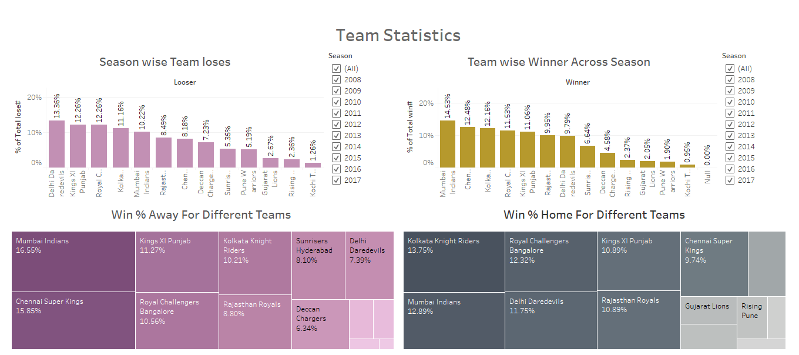
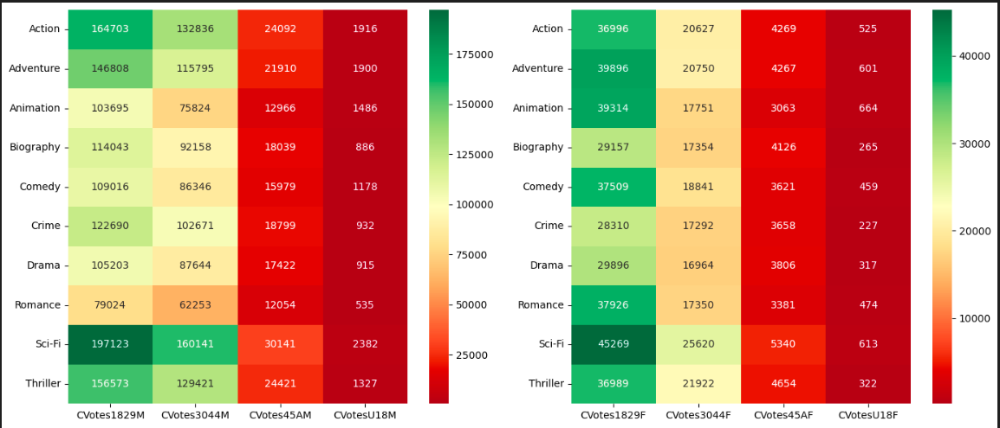
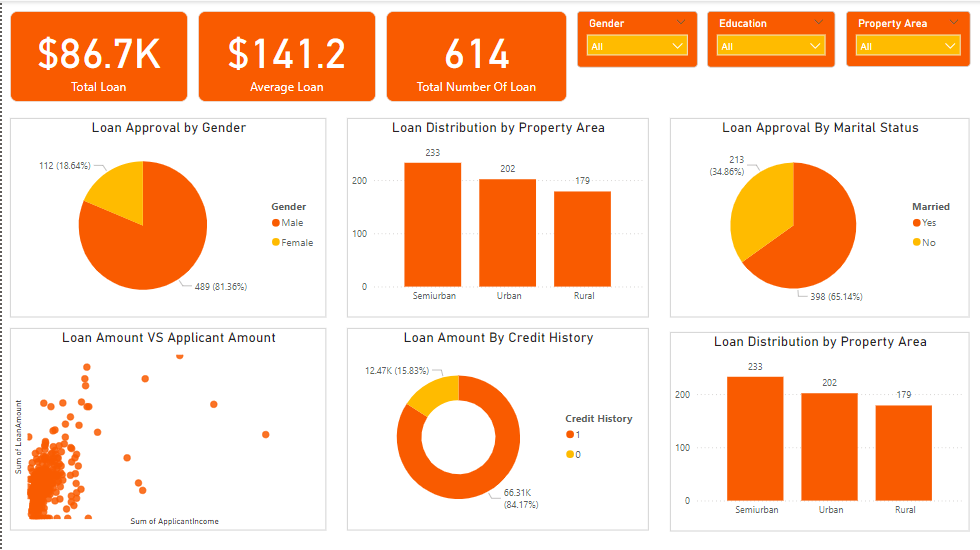

# 🌟 Welcome to My Portfolio 🌟 

---

### 🚀 Adventure Works Report 

The Adventure Works Data Analysis project is a comprehensive exploration of the company's extensive dataset, designed to unlock valuable insights and inform strategic decisions. 📈🔍💡 #PowerBI

[**See More**](/Pages/Adventure_Works.md)

---

### E-Commerce Sales Analytics Dashboard 📊🛍️

Developed a robust e-commerce sales analytics dashboard using PowerBI, 📊 leveraging a dataset with key details like Order ID, 📅 Date, 🚚 Ship Mode, and 👤 Customer information. Provides valuable insights into overall business performance.

[**See More**](/Pages/Ecom_Sales.md)

---

### HR Analytics Dashboard 📊👥

Built a comprehensive HR Analytics dashboard that illuminates insights on employee attribution based on 📅 Age, 💰 Salary, 🎓 Education, 🧑‍💼 Job Role, 👫 Gender, and 📅 Year.

[**See More**](/Pages/HR_Analysis.md)

---

### IPL Data Analysis Dashboard 📊🏏

Conducted in-depth analysis on the IPL dataset, culminating in the development of three comprehensive dashboards. These dashboards meticulously explore Match statistics, Player statistics, and Team statistics, providing a nuanced perspective on the dynamics within the realm of IPL cricket. 📈🏆

[**See More**](/Pages/IPL_Analysis.md)

---

### IMDB Data EDA and Visualization using Python 🎬📊

---

### 💼 Loan Approval Insights Dashboard 📊

The Loan Approval Insights Dashboard provides a comprehensive analysis of 🏦 loan distribution and approval patterns based on key applicant demographics. It offers valuable insights into how factors like 👩‍💼 gender, 🎓 education, ✅ credit history, and 🏠 property area influence loan approvals and amounts. The dashboard features interactive visuals such as 📊 bar charts, scatter plots, and pie charts, making it easy for users to explore relationships between loan characteristics and applicant income 💵.

[**See More**]()

Conducted a thorough Exploratory Data Analysis (EDA) on the IMDB dataset using Python within Jupyter Notebook. This project delves into the intricacies of the dataset, unraveling valuable insights about the world of cinema. From analyzing movie attributes to exploring trends, the EDA encompasses a range of visualizations that offer a comprehensive understanding of the dataset's cinematic landscape. 📈🎥
