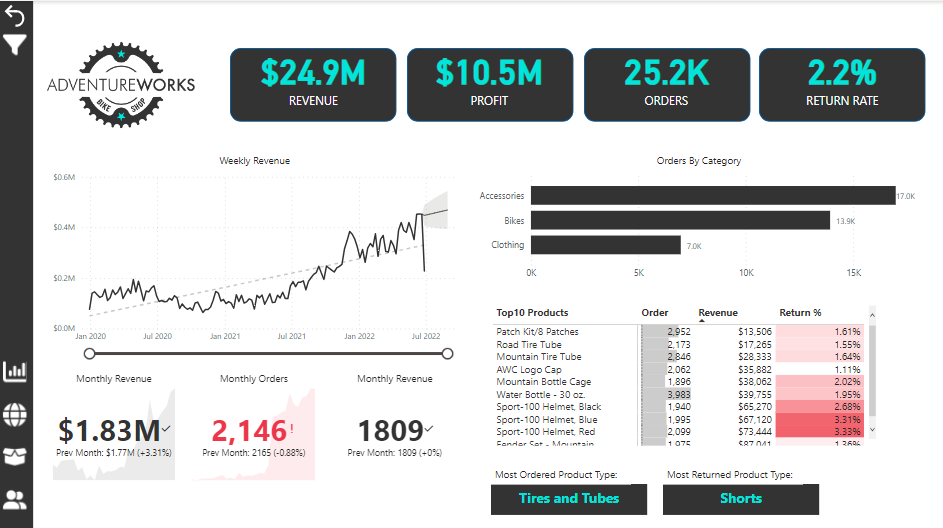
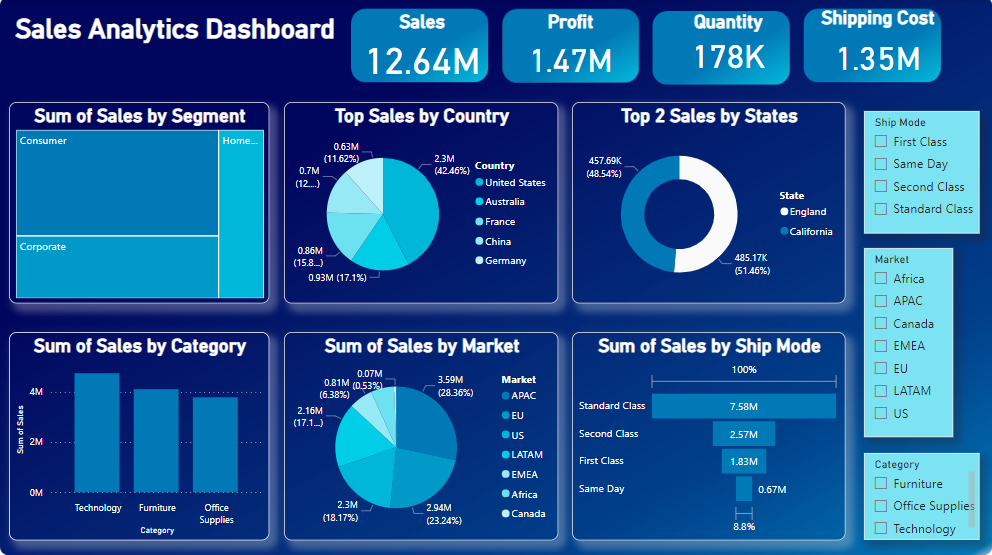
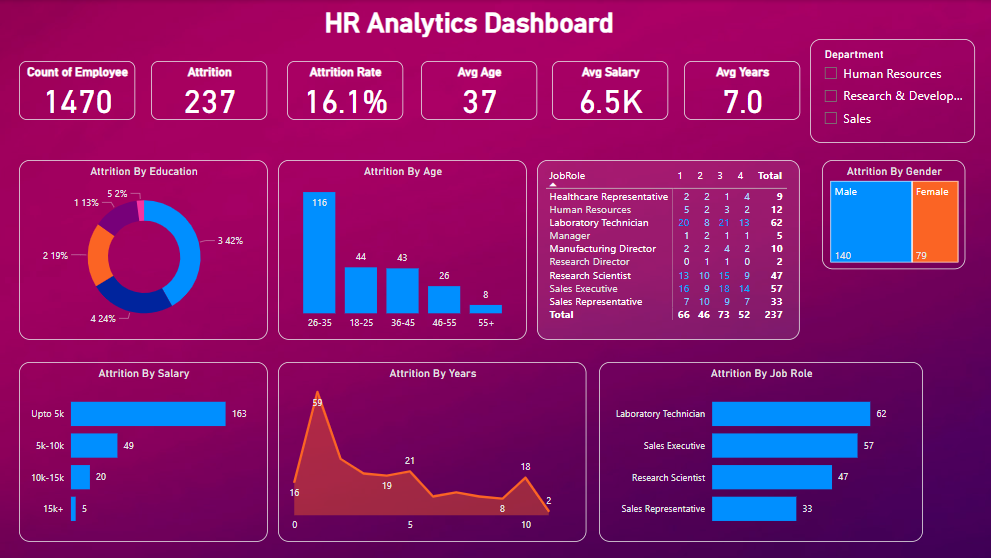

# 🌟 Welcome to My Portfolio 🌟 

---

### 🚀 Adventure Works Report 

The Adventure Works Data Analysis project is a comprehensive exploration of the company's extensive dataset, designed to unlock valuable insights and inform strategic decisions. 📈🔍💡 #PowerBI

[**See More**](/sample_page.md)

---

### E-Commerce Sales Analytics Dashboard 📊🛍️

Developed a robust e-commerce sales analytics dashboard using PowerBI, 📊 leveraging a dataset with key details like Order ID, 📅 Date, 🚚 Ship Mode, and 👤 Customer information. Provides valuable insights into overall business performance.

[**See More**](/sample_page.md)

---

### HR Analytics Dashboard 📊👥

Built a comprehensive HR Analytics dashboard that illuminates insights on employee attribution based on 📅 Age, 💰 Salary, 🎓 Education, 🧑‍💼 Job Role, 👫 Gender, and 📅 Year.

[**See More**](/sample_page.md)

---

### IPL Data Analysis Dashboard 📊🏏

### Category Name 2

- [Project 1 Title](http://example.com/)
- [Project 2 Title](http://example.com/)
- [Project 3 Title](http://example.com/)
- [Project 4 Title](http://example.com/)
- [Project 5 Title](http://example.com/)

---

---

Page template forked from <a href="https://github.com/evanca/quick-portfolio">evanca</a>

<!-- Remove above link if you don't want to attibute -->
